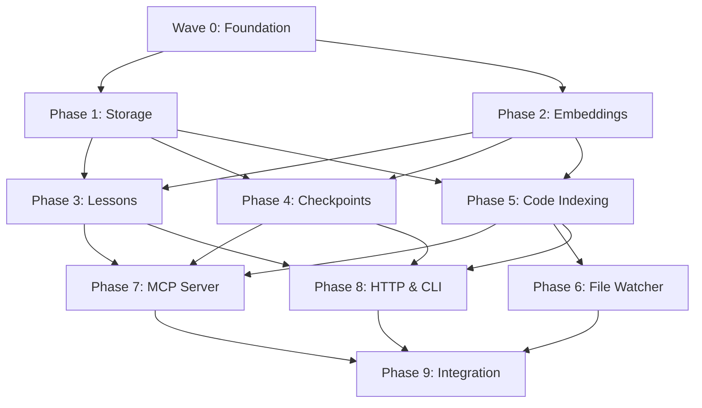

# DEVELOPMENT_PLAN.md — amp-rs

## How to Use This Plan

**Structure**: This is an overview/TOC. Each phase has its own detailed plan in `plans/`.

**For Claude Code executor agent**:
```
Use the amp-rs-executor agent to execute subtask X.Y.Z
```

**For manual execution**: Read this file for context, then open the relevant phase plan for subtask details.

---

## Project Overview

**Project**: amp-rs
**Goal**: Reference implementation of Agent Memory Protocol (AMP) — a local-first MCP server with checkpoints, lessons, semantic search, and code indexing, built in Rust.
**Timeline**: 4 weeks
**Team Size**: 1

---

## Technology Stack

| Component | Crate | Purpose |
|-----------|-------|---------|
| MCP Protocol | `rmcp` | Official Anthropic MCP SDK for Rust |
| Async Runtime | `tokio` | Industry standard, required by rmcp |
| HTTP Server | `axum` | Health checks, REST endpoints |
| Vector Storage | `rusqlite` + `sqlite-vec` | Embedded vector search |
| Embeddings | `ort` (ONNX Runtime) | Local all-MiniLM-L6-v2 inference |
| File Watching | `notify` | Cross-platform file change detection |
| CLI | `clap` | Command-line interface |
| Serialization | `serde` + `serde_json` | JSON I/O |
| Logging | `tracing` + `tracing-subscriber` | Structured logging |
| Error Handling | `anyhow` + `thiserror` | Error types |
| Config | `toml` | Config file parsing |
| IDs | `uuid` | Unique identifiers |
| Time | `chrono` | Timestamps |

---

## Phase Map

| Phase | Name | Plan File | Tasks | Subtasks |
|-------|------|-----------|-------|----------|
| 0 | Foundation | [plans/PHASE_0_FOUNDATION.md](plans/PHASE_0_FOUNDATION.md) | 2 | 5 |
| 1 | Storage Layer | [plans/PHASE_1_STORAGE.md](plans/PHASE_1_STORAGE.md) | 2 | 5 |
| 2 | Embedding Engine | [plans/PHASE_2_EMBEDDINGS.md](plans/PHASE_2_EMBEDDINGS.md) | 2 | 4 |
| 3 | Lessons System | [plans/PHASE_3_LESSONS.md](plans/PHASE_3_LESSONS.md) | 2 | 5 |
| 4 | Checkpoint System | [plans/PHASE_4_CHECKPOINTS.md](plans/PHASE_4_CHECKPOINTS.md) | 2 | 5 |
| 5 | Code Indexing | [plans/PHASE_5_CODE_INDEXING.md](plans/PHASE_5_CODE_INDEXING.md) | 2 | 5 |
| 6 | File Watcher | [plans/PHASE_6_FILE_WATCHER.md](plans/PHASE_6_FILE_WATCHER.md) | 2 | 4 |
| 7 | MCP Server | [plans/PHASE_7_MCP_SERVER.md](plans/PHASE_7_MCP_SERVER.md) | 2 | 5 |
| 8 | HTTP & CLI | [plans/PHASE_8_HTTP_CLI.md](plans/PHASE_8_HTTP_CLI.md) | 2 | 5 |
| 9 | Integration & Release | [plans/PHASE_9_INTEGRATION.md](plans/PHASE_9_INTEGRATION.md) | 2 | 5 |
| **Total** | | | **20** | **48** |

---

## Progress Tracking

### Phase 0: Foundation
- [ ] 0.1.1: Initialize Cargo project
- [ ] 0.1.2: Configure dependencies in Cargo.toml
- [ ] 0.1.3: Create module skeleton
- [ ] 0.2.1: Linting and formatting setup
- [ ] 0.2.2: Testing infrastructure

### Phase 1: Storage Layer
- [ ] 1.1.1: SQLite connection manager with WAL
- [ ] 1.1.2: Schema and migrations
- [ ] 1.1.3: sqlite-vec extension loading
- [ ] 1.2.1: Storage trait and error types
- [ ] 1.2.2: Storage integration tests

### Phase 2: Embedding Engine
- [ ] 2.1.1: ONNX Runtime session setup
- [ ] 2.1.2: Tokenizer and embedding generation
- [ ] 2.2.1: Dedicated thread pool for embeddings
- [ ] 2.2.2: Embedding engine tests

### Phase 3: Lessons System
- [ ] 3.1.1: Lesson model and storage operations
- [ ] 3.1.2: Lesson semantic search
- [ ] 3.1.3: Lesson list and filter
- [ ] 3.2.1: Lesson service layer
- [ ] 3.2.2: Lesson unit and integration tests

### Phase 4: Checkpoint System
- [ ] 4.1.1: Checkpoint model and storage operations
- [ ] 4.1.2: Checkpoint semantic search
- [ ] 4.1.3: Agent status tracking
- [ ] 4.2.1: Checkpoint service layer
- [ ] 4.2.2: Checkpoint unit and integration tests

### Phase 5: Code Indexing
- [ ] 5.1.1: File scanner with .gitignore support
- [ ] 5.1.2: Language-aware chunking
- [ ] 5.1.3: Chunk storage and vector indexing
- [ ] 5.2.1: Semantic code search
- [ ] 5.2.2: Code indexing integration tests

### Phase 6: File Watcher
- [ ] 6.1.1: notify-rs watcher setup
- [ ] 6.1.2: Incremental indexing (mtime-based diff)
- [ ] 6.2.1: On-demand indexing tools (index_repo, diff_index, full_reindex)
- [ ] 6.2.2: File watcher integration tests

### Phase 7: MCP Server
- [ ] 7.1.1: rmcp server bootstrap (stdio transport)
- [ ] 7.1.2: Lesson MCP tools (add, search, list, delete)
- [ ] 7.1.3: Checkpoint MCP tools (add, get_recent, search, get_status)
- [ ] 7.2.1: Code search and indexing MCP tools
- [ ] 7.2.2: Server status tool and MCP integration tests

### Phase 8: HTTP & CLI
- [ ] 8.1.1: Axum HTTP server with health check
- [ ] 8.1.2: REST status endpoint
- [ ] 8.1.3: Serve command combining MCP + HTTP
- [ ] 8.2.1: clap CLI with config file support
- [ ] 8.2.2: CLI and config integration tests

### Phase 9: Integration & Release
- [ ] 9.1.1: End-to-end MCP protocol tests
- [ ] 9.1.2: Cross-feature integration tests
- [ ] 9.1.3: Performance benchmarks
- [ ] 9.2.1: CI/CD with GitHub Actions
- [ ] 9.2.2: Documentation and release prep

**Current**: Phase 0
**Next**: 0.1.1

---

## Waves — Parallel Execution Plan

See [plans/WAVES.md](plans/WAVES.md) for the full parallel execution strategy.

### Wave Summary

```
Wave 0: Phase 0 (Foundation)
    └── Sequential — must complete before anything else

Wave 1: Phase 1 + Phase 2 (Storage + Embeddings)
    ├── Phase 1: Storage Layer     ─┐
    └── Phase 2: Embedding Engine  ─┘ parallel (independent subsystems)

Wave 2: Phase 3 + Phase 4 + Phase 5 (Core Features)
    ├── Phase 3: Lessons System      ─┐
    ├── Phase 4: Checkpoint System   ─┤ parallel (all depend on Wave 1, not each other)
    └── Phase 5: Code Indexing       ─┘

Wave 3: Phase 6 + Phase 7 + Phase 8 (Server Layer)
    ├── Phase 6: File Watcher  ─┐
    ├── Phase 7: MCP Server    ─┤ parallel (all depend on Wave 2, not each other)
    └── Phase 8: HTTP & CLI    ─┘

Wave 4: Phase 9 (Integration & Release)
    └── Sequential — depends on everything
```

### Wave Dependency Graph



---

## Git Workflow

### Branch Strategy
- **ONE branch per TASK** (e.g., `feature/1-1-sqlite-storage`)
- Subtasks are commits within the task branch
- Branch naming: `feature/{phase}-{task}-{short-description}`

### Per-Subtask (inline in every subtask):
```bash
# After completing subtask work:
git add -A && git commit -m "feat(scope): subtask X.Y.Z description"
```

### Per-Task Complete (inline in every task):
```bash
# Squash merge to main:
git checkout main && git merge --squash feature/{branch}
git commit -m "feat(scope): complete task X.Y - description"
git branch -d feature/{branch}
git push origin main
```

### Worktree Strategy for Parallel Waves
When executing parallel phases in the same wave, use git worktrees:
```bash
# Create worktrees for parallel phases
git worktree add ../amp-rs-phase-1 -b feature/1-1-sqlite-storage
git worktree add ../amp-rs-phase-2 -b feature/2-1-onnx-setup

# Work in each worktree independently
# Merge each back to main when complete
# Remove worktrees after merge
git worktree remove ../amp-rs-phase-1
git worktree remove ../amp-rs-phase-2
```

---

## Lessons Learned Safeguards

### Critical
- **Parallel cargo commands crash server**: Always chain cargo commands sequentially with `&&`. Never run in parallel.
- **ONNX/native first build CPU exhaustion**: First `cargo build` with ONNX Runtime will take a long time. Don't start other cargo processes during first build.
- **Branch switch invalidates native build cache**: For heavy native deps (ONNX, sqlite-vec), use worktrees instead of branch switching to preserve `target/` artifacts.
- **Implicit instructions not repeated per-subtask**: ALL git, verification, and checkpoint commands must be explicit in EVERY subtask.

### Warnings
- **Missing git push**: Always `git push origin main` after squash merge. Include in every Task Complete section.
- **Generic scaffold**: This plan has been enhanced from the DevPlan scaffold with amp-rs specific content.

---

## MVP Scope Checklist

- [ ] MCP server over stdio transport (rmcp)
- [ ] Semantic code search (all-MiniLM-L6-v2 + sqlite-vec)
- [ ] Lessons learned system (add, search, list, delete)
- [ ] Agent checkpoints (save, restore, search)
- [ ] Repository indexing (scan, chunk, embed, store)
- [ ] File watching (incremental, .gitignore-aware)
- [ ] Checkpoint search (semantic)
- [ ] Agent status tracking (idle/in_progress)
- [ ] On-demand indexing tools (index_repo, diff_index, full_reindex)
- [ ] Server status and stats
- [ ] SQLite + WAL mode
- [ ] ONNX embeddings on thread pool
- [ ] CLI with config file support
- [ ] Single binary deployment
- [ ] Health check + REST endpoints (Axum)

---

## v2 Roadmap (Post-MVP)

Deferred to after MVP is complete and stable:

| v2 Feature | Phase |
|------------|-------|
| Knowledge graph (petgraph) | v2.1 |
| Enriched tool schemas (graph fields) | v2.2 |
| Hybrid search (vector + graph) | v2.3 |
| Graph query API | v2.4 |
| Bootstrap tool | v2.5 |
| Fuzzy entity matching | v2.6 |
| Confidence/integrity system | v2.7 |
| Web dashboard (htmx) | v2.8 |
| Prometheus metrics | v2.9 |
| API key authentication | v2.10 |

---

*Generated by DevPlan MCP Server — enhanced for amp-rs*
