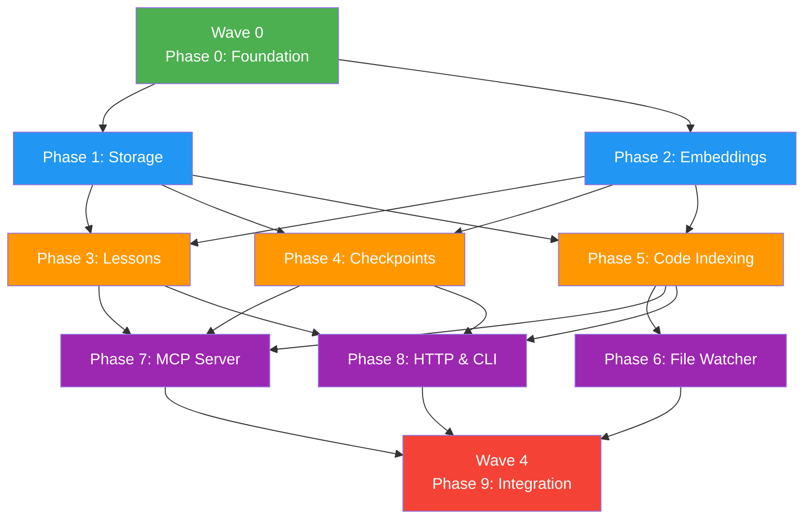

# WAVES.md — Parallel Execution Plan

## Overview

The 10 phases of amp-rs are organized into 5 waves based on dependency analysis. Phases within the same wave can execute in parallel (using git worktrees or multiple agents).

---

## Wave Dependency Graph



---

## Wave 0: Foundation (Sequential)

**Phases**: 0
**Parallelism**: None (must complete first)
**Estimated Duration**: 1–2 days

| Phase | Tasks | Subtasks | Description |
|-------|-------|----------|-------------|
| 0 | 0.1, 0.2 | 5 | Cargo init, deps, module skeleton, linting, tests |

**Start**: Immediately
**Complete when**: `cargo fmt --check && cargo clippy --workspace -- -D warnings && cargo test --workspace` passes

### Execution
```bash
# Single branch, single agent
git checkout -b feature/0-1-project-init
# ... complete all Phase 0 subtasks ...
git checkout main && git merge --squash feature/0-1-project-init
git push origin main
```

---

## Wave 1: Infrastructure (2 parallel)

**Phases**: 1 (Storage), 2 (Embeddings)
**Parallelism**: 2 agents or worktrees
**Estimated Duration**: 2–3 days
**Blocked by**: Wave 0

| Phase | Tasks | Subtasks | Description |
|-------|-------|----------|-------------|
| 1 | 1.1, 1.2 | 5 | SQLite + WAL, schema, sqlite-vec, storage trait |
| 2 | 2.1, 2.2 | 4 | ONNX session, tokenizer, thread pool |

**Why parallel**: Storage and embedding engine are independent subsystems. Neither depends on the other. They only share Phase 0's project skeleton.

### Worktree Execution
```bash
# Create worktrees for parallel work
git worktree add ../amp-rs-storage -b feature/1-1-sqlite-core
git worktree add ../amp-rs-embeddings -b feature/2-1-onnx-setup

# Agent 1 works in ../amp-rs-storage (Phase 1)
# Agent 2 works in ../amp-rs-embeddings (Phase 2)

# After each completes, merge back to main:
cd /path/to/amp-rs  # main worktree
git checkout main

# Merge storage
cd ../amp-rs-storage
git checkout main && git merge --squash feature/1-1-sqlite-core
git push origin main

# Merge embeddings
cd ../amp-rs-embeddings
git checkout main && git merge --squash feature/2-1-onnx-setup
git push origin main

# Cleanup
git worktree remove ../amp-rs-storage
git worktree remove ../amp-rs-embeddings
```

### CRITICAL: Build Cache Warning
**First cargo build with ONNX Runtime will be CPU-intensive.** If running both worktrees on the same machine:
1. Build Phase 1 (storage) first — it's lighter
2. Then start Phase 2 (embeddings) — heavier native deps
3. Or: use separate machines / CI runners

**Do NOT run `cargo build` simultaneously in both worktrees** — this can exhaust CPU and cause crashes.

---

## Wave 2: Core Features (3 parallel)

**Phases**: 3 (Lessons), 4 (Checkpoints), 5 (Code Indexing)
**Parallelism**: 3 agents or worktrees
**Estimated Duration**: 3–4 days
**Blocked by**: Wave 1 (both Phase 1 AND Phase 2 must be complete)

| Phase | Tasks | Subtasks | Description |
|-------|-------|----------|-------------|
| 3 | 3.1, 3.2 | 5 | Lesson model, CRUD, search, service, tests |
| 4 | 4.1, 4.2 | 5 | Checkpoint model, save/restore, status, tests |
| 5 | 5.1, 5.2 | 5 | Scanner, chunker, storage, code search, tests |

**Why parallel**: Lessons, checkpoints, and code indexing are independent feature modules. They all depend on storage (Phase 1) and embeddings (Phase 2) but not on each other.

### Worktree Execution
```bash
git worktree add ../amp-rs-lessons -b feature/3-1-lesson-model
git worktree add ../amp-rs-checkpoints -b feature/4-1-checkpoint-model
git worktree add ../amp-rs-indexing -b feature/5-1-indexing-pipeline

# 3 agents work independently
# Merge each back to main when complete (sequential merges to avoid conflicts)
```

### Merge Order
Merge phases back to main one at a time. Order doesn't matter since they're independent, but suggested order:
1. Phase 3 (Lessons) — smallest surface area
2. Phase 4 (Checkpoints) — similar to lessons
3. Phase 5 (Code Indexing) — largest, most files

After each merge, pull latest main into remaining worktrees before their final merge.

---

## Wave 3: Server Layer (3 parallel)

**Phases**: 6 (File Watcher), 7 (MCP Server), 8 (HTTP & CLI)
**Parallelism**: 3 agents or worktrees
**Estimated Duration**: 3–4 days
**Blocked by**: Wave 2 (all three feature phases must be complete)

| Phase | Tasks | Subtasks | Description |
|-------|-------|----------|-------------|
| 6 | 6.1, 6.2 | 4 | notify-rs watcher, incremental indexing, tools |
| 7 | 7.1, 7.2 | 5 | rmcp stdio, all 13 MCP tools |
| 8 | 8.1, 8.2 | 5 | Axum HTTP, clap CLI, config, serve command |

**Why parallel**: File watcher, MCP server, and HTTP/CLI are independent interface layers over the same underlying services. They don't call each other.

### Worktree Execution
```bash
git worktree add ../amp-rs-watcher -b feature/6-1-file-watcher
git worktree add ../amp-rs-mcp -b feature/7-1-mcp-server
git worktree add ../amp-rs-http -b feature/8-1-http-cli
```

### Merge Order
**Phase 8 should merge last** because it contains the `serve` command in `main.rs` that ties everything together. Suggested:
1. Phase 6 (File Watcher)
2. Phase 7 (MCP Server)
3. Phase 8 (HTTP & CLI) — may need to resolve `main.rs` conflicts from Phase 7

---

## Wave 4: Integration (Sequential)

**Phases**: 9
**Parallelism**: None (integration testing requires all features)
**Estimated Duration**: 3–4 days
**Blocked by**: Wave 3 (all three server phases must be complete)

| Phase | Tasks | Subtasks | Description |
|-------|-------|----------|-------------|
| 9 | 9.1, 9.2 | 5 | E2E tests, cross-feature tests, benchmarks, CI/CD, docs |

**Start**: After all Wave 3 phases merged to main
**Complete when**: MVP checklist in Phase 9 plan is fully checked

### Execution
```bash
# Single branch, single agent — needs complete codebase
git checkout -b feature/9-1-integration-tests
```

---

## Timeline Summary

```
Week 1:
  Day 1-2: Wave 0 (Foundation)
  Day 3-5: Wave 1 (Storage ∥ Embeddings)

Week 2:
  Day 1-4: Wave 2 (Lessons ∥ Checkpoints ∥ Indexing)

Week 3:
  Day 1-4: Wave 3 (Watcher ∥ MCP ∥ HTTP/CLI)

Week 4:
  Day 1-4: Wave 4 (Integration & Release)
```

**Total with parallelism**: ~4 weeks (matching PROJECT_BRIEF.md timeline)
**Total sequential (no parallelism)**: ~6–7 weeks

---

## Pre-Push Checklist (Every Wave Completion)

Before pushing any merged work to `origin/main`:

```bash
# CRITICAL: Run sequentially, never in parallel
cargo fmt --check && cargo clippy --workspace -- -D warnings && cargo test --workspace
```

Then:
```bash
git push origin main
```

---

## Agent Assignment (for parallel execution)

| Wave | Agent 1 | Agent 2 | Agent 3 |
|------|---------|---------|---------|
| 0 | Phase 0 | — | — |
| 1 | Phase 1 (Storage) | Phase 2 (Embeddings) | — |
| 2 | Phase 3 (Lessons) | Phase 4 (Checkpoints) | Phase 5 (Indexing) |
| 3 | Phase 6 (Watcher) | Phase 7 (MCP) | Phase 8 (HTTP/CLI) |
| 4 | Phase 9 | — | — |

---

*Generated for amp-rs development plan*
